# 血染鐘樓魔典輔助程式 - 一般玩家（Player）使用手冊
---
##  魔典公開資訊查閱
在遊戲過程中，玩家最核心的畫面是主畫面的圓環魔典，可得知全局狀況。

##  主畫面與全域控制區

### 1. 新增玩家
*   **操作流程**：
    1. 點擊主畫面左下角金色邊框內含黑色「」圖示的按鈕。
    2. 螢幕中央會彈出一個半透明輸入框，在輸入欄中填寫玩家名稱。
    3. 點擊「確認」即可在魔典上新增一個玩家座位。
    
    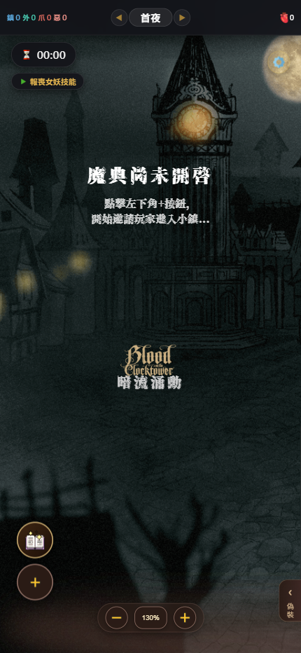
    
    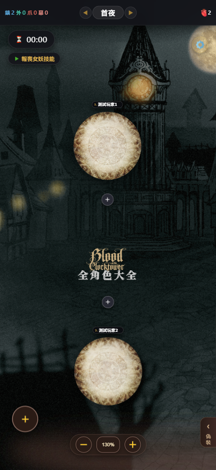

### 2. 玩家座次與生死狀態
* **視覺位置**：主畫面中央由所有玩家頭像圍繞成的圓環。
* **元素辨識**：
  * **存活玩家**：頭像明亮，顯示角色名稱。
    
  * **死亡玩家**：頭像灰色半透明，中心有骷髏頭圖示。
  * **幽靈投票標記**：死亡玩家旁顯示幽靈投票券（），亮起表示未消耗。
    

### 3. 當前遊戲階段與日誌
* **視覺位置**：螢幕頂部中央的狀態欄。
* **元素辨識**：頂部大字顯示當前階段，如「首夜」、「白天 (第 1 天)」或「夜晚 (第 1 夜)」。
##  劇本管理
此階段玩家可管理劇本、角色庫與設定。以下截圖挑選了關鍵步驟，完整流程請參見測試腳本。
**第一步：開啟設定面板**
*   **操作流程**：點選主畫面右下角「齒輪 」按鈕展開選單，點選選單中帶有「」圖示的 **設置** 按鈕，開啟系統設定面板。
    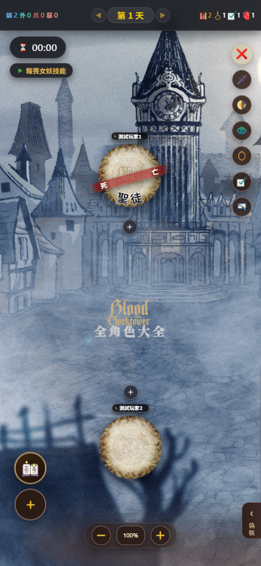
    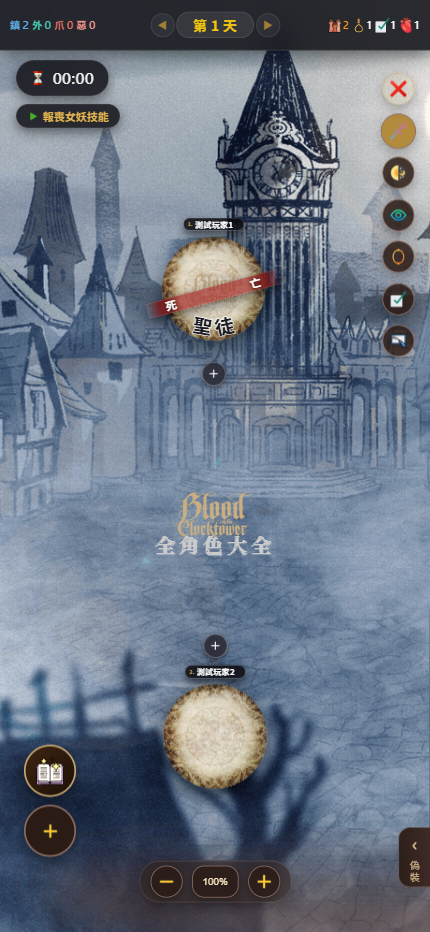
    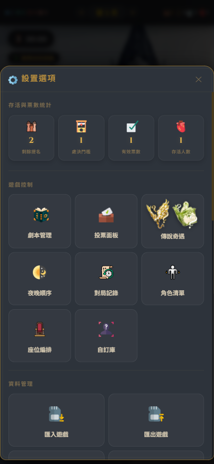
*   **第二步：開啟劇本管理**
    *   **操作流程**：在設定面板中，點擊帶有「 」圖示的 **劇本管理** 按鈕，劇本管理系統面板將會滑入。
    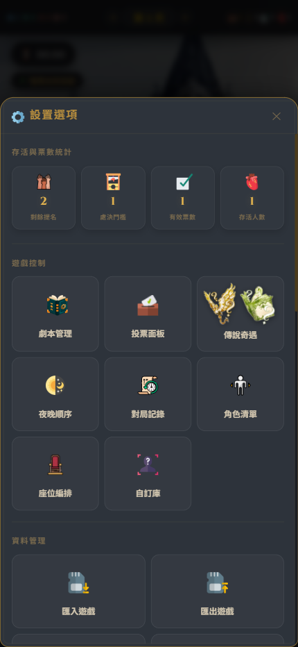
    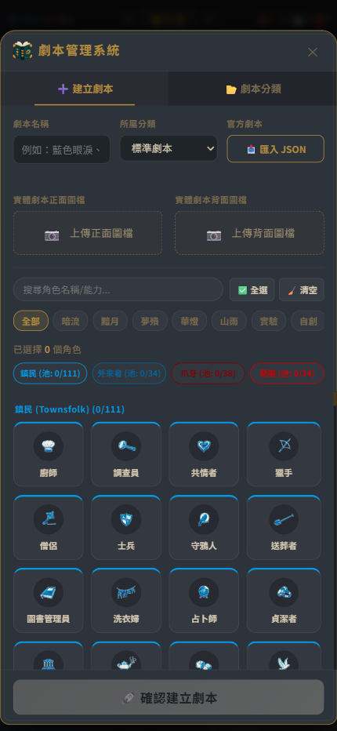 
*   **第三步：分頁導覽**
    *   **操作流程**：面板標題下方有兩個大分頁按鈕：
        1.  ` 建立劇本` (編輯時為 ` 編輯劇本`)：管理劇本資料與角色池配置。
        2.  ` 劇本分類`：管理自訂分類排序與劇本快速歸類。    
    
    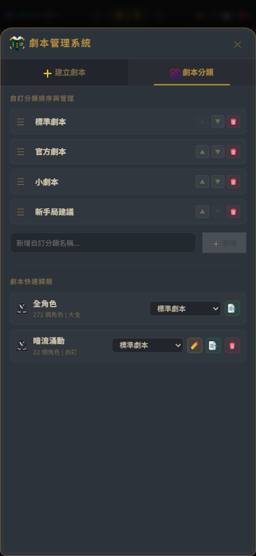
---
##  分頁一：建立與編輯劇本
本分頁用於輸入劇本資料，並從角色池中選取要加入劇本的角色：
### 1. 輸入劇本基礎資料
*   **劇本名稱**：在面板左側「劇本名稱」輸入框中打入劇本名稱。
    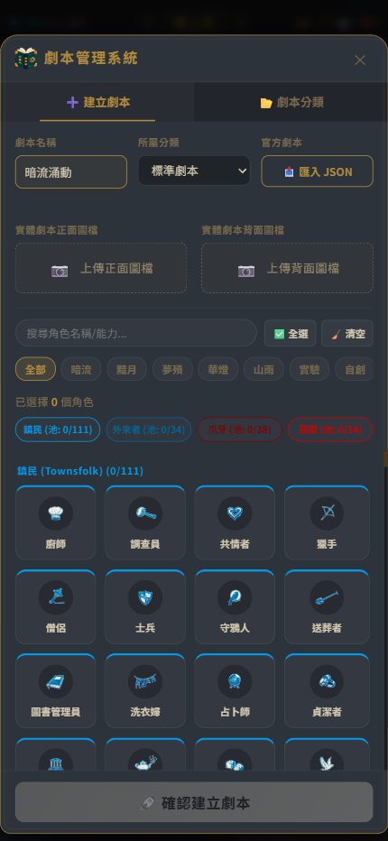
*   **所屬分類**：在下拉選單中為此劇本選擇一個所屬類別。
    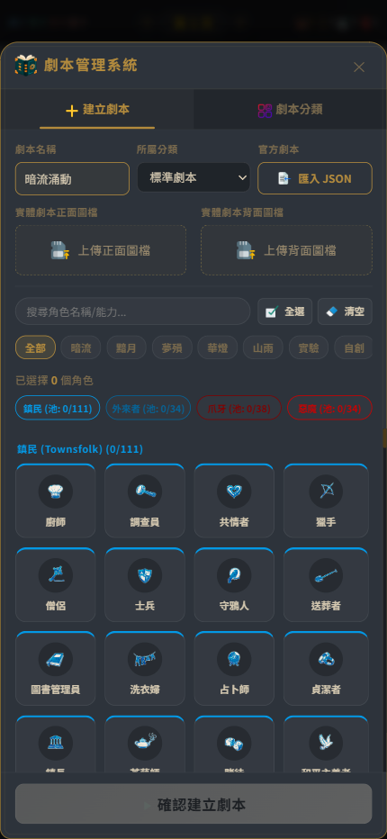
*   **匯入 JSON 劇本**：點選劇本欄位旁的 ** 匯入 JSON** 按鈕，選取本機劇本檔可直接匯入。
    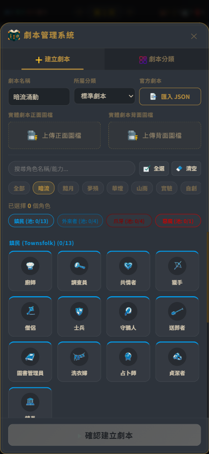
*   **上傳實體劇本圖檔**：點選右側帶有「」圖示的上傳框選取圖片。上傳後可看到縮圖與 ** 刪除圖檔** 按鈕。
    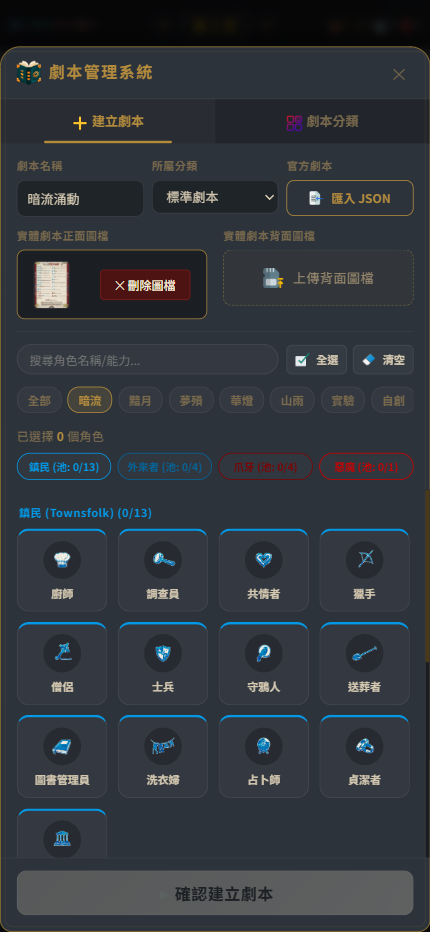
### 2. 篩選與選擇角色
*   **關鍵字搜尋**：在角色搜尋框中輸入關鍵字，過濾出要找的角色。
    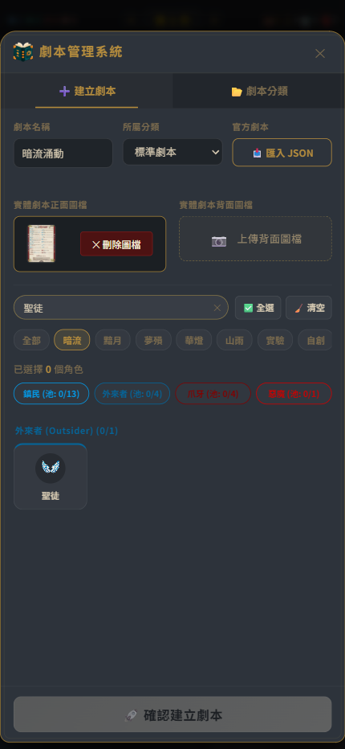 
*   **批次操作**：點選 ** 全選** 可以把當前列出的角色全部勾選，點選 ** 清空** 則能全部取消勾選。
    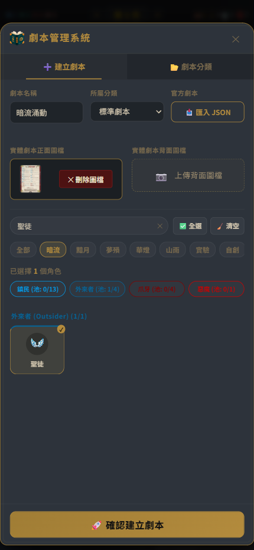
    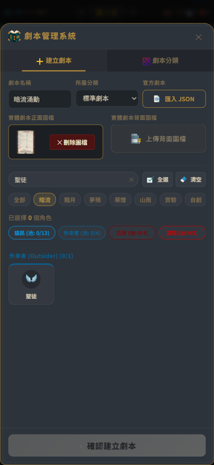
*   **版本過濾**：點擊版本標籤切換過濾官方、自訂等角色來源。
    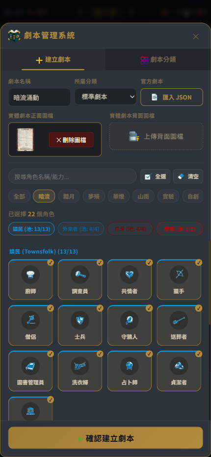   
*   **勾選角色**：在下方的角色網格中直接點選角色卡片，勾選的角色卡片右上角會標示綠色勾號「✓」且高亮。
    
### 3. 儲存劇本
*   **儲存按鈕**：點擊底部右側 ** 確認建立劇本** 按鈕（編輯下為 ** 確認儲存變更**）儲存。
    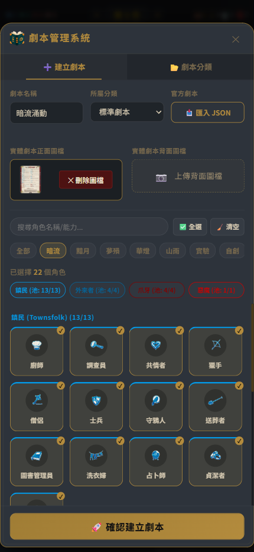  
*   **取消編輯**：編輯狀態下點擊左下角 ** 取消** 按鈕可放棄修改退出。
    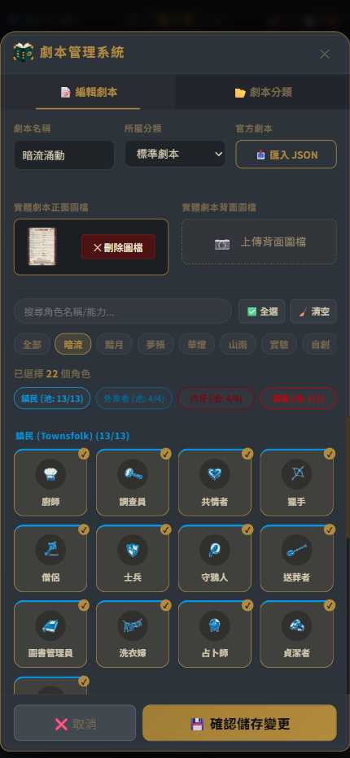
---
##  分頁二：劇本分類管理
本分頁用於編輯劇本分類的排序，以及將現有劇本分配至不同類別中：
### 1. 分類名稱與排序管理
*   **分類分頁**：點選「 劇本分類」分頁按鈕進入管理。
    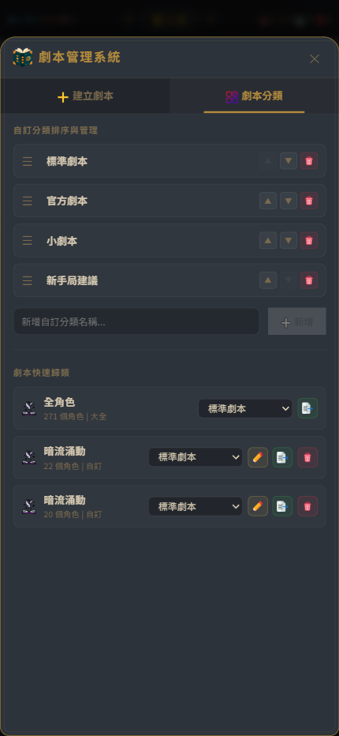  
*   **修改分類名稱**：點選文字框直接修改分類名稱。
    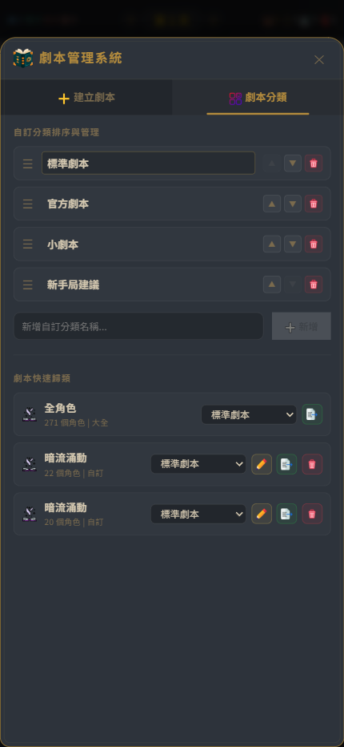
*   **排序與刪除**：按住手柄「」可以上下拖曳分類順序，或點點右側上下移按鈕。點選垃圾桶圖示（）將刪除分類。
     
*   **新增分類**：在底部輸入名稱並點選 ** 新增** 按鈕。
    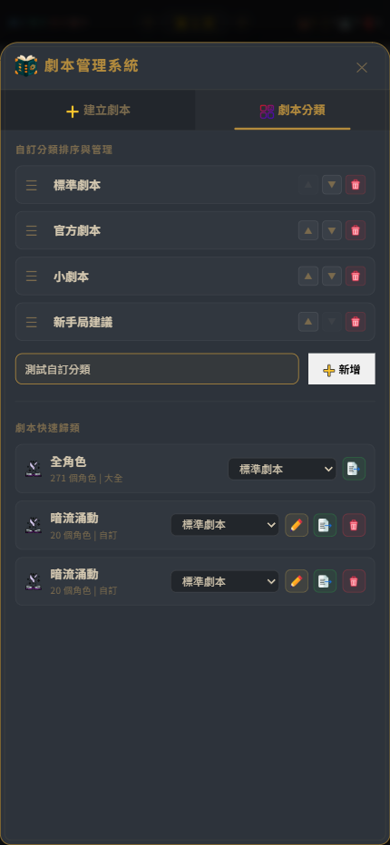
### 2. 劇本歸類管理
*   **變更歸類**：使用下拉選單快速變更劇本所屬分類。
    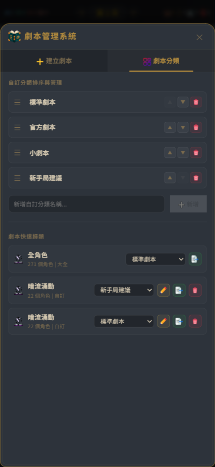   
*   **編輯與導出**：點擊編輯圖示（）將載入劇本並切換回分頁一；點擊匯出按鈕（）可下載該劇本的 JSON 檔案。
    
    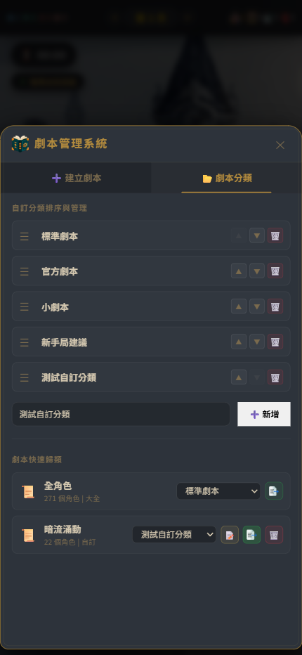
    
*   **刪除劇本**：點擊垃圾桶圖示（）可完全刪除該自訂劇本。
    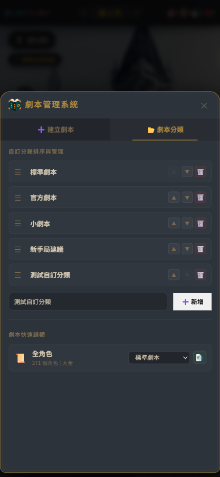
---
##  劇本與角色庫查閱
玩家可檢視實體劇本大圖，以便對照角色資訊。
### 1.檢視實體劇本（實體劇本大圖）
*   操作流程： 
1. **首頁概覽**
    1. 點擊「新增玩家」按鈕正上方的實體劇本圖標按鈕 。
   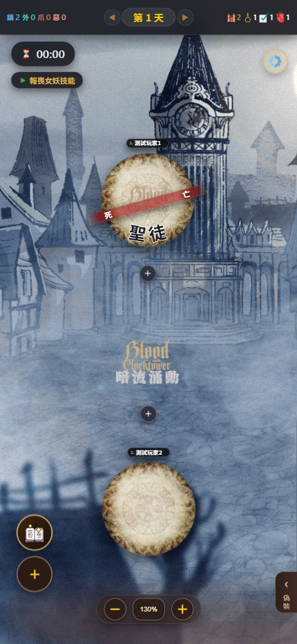
2. **點擊檢視實體劇本按鈕**
   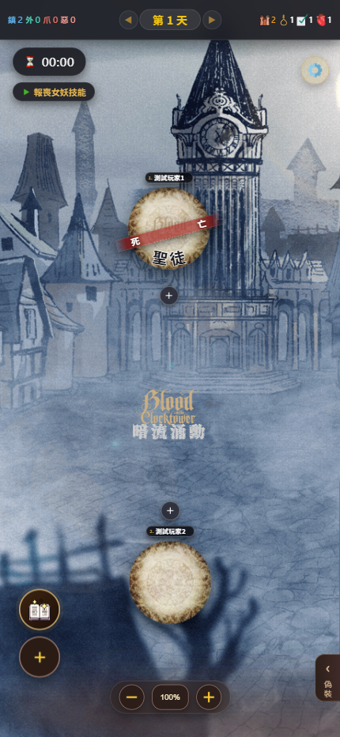
3. **實體大圖彈窗載入**
   
4. **拖曳大圖**
   您可以對大圖進行拖曳、雙指捏合縮放。點擊大圖右上角的「」按鈕或點擊大圖外側陰影處，即可關閉大圖。
   
5. **關閉彈窗**
   
---
##  接收說書人資訊（白板與私訊）
說書人白板訊息會透過文字或投影方式呈現給玩家。
1. **白板開啟前的主畫面**
   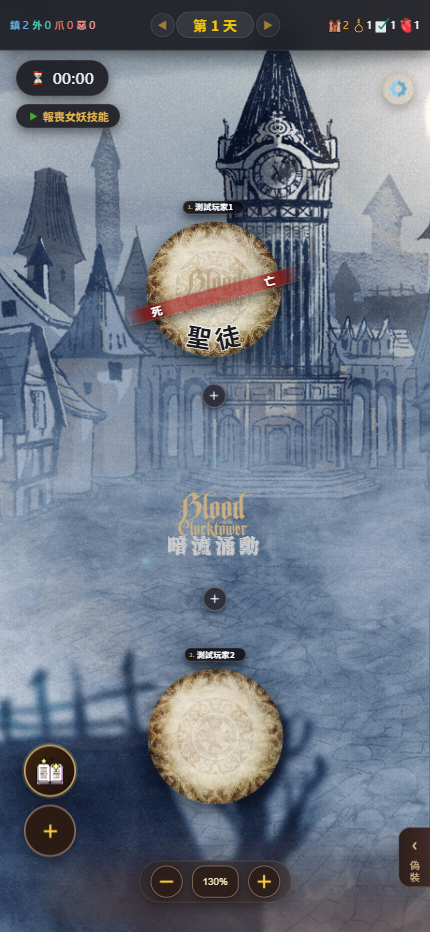
2. **點擊白板按鈕**
   
3. **白板面板開啟**
   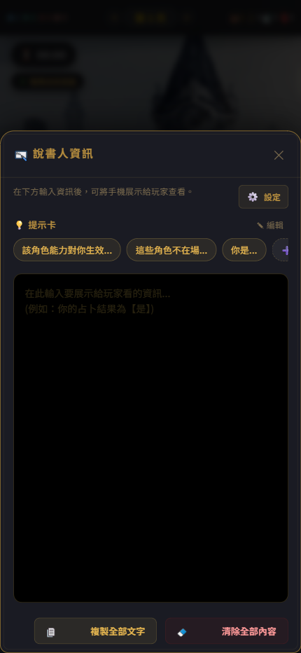
4. **填寫白板文字**
   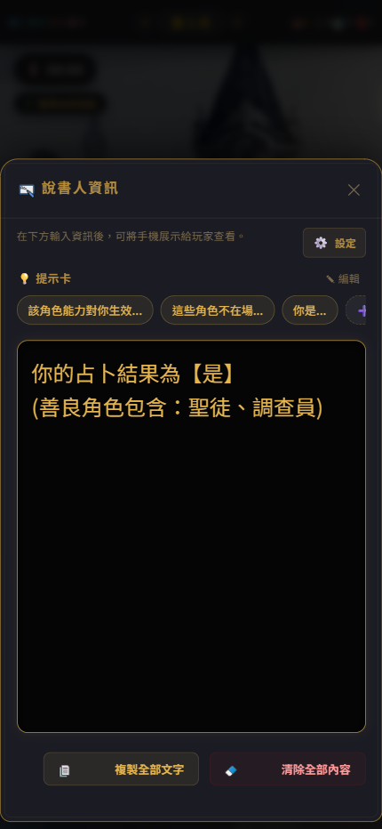
5. **點擊複製按鈕**
   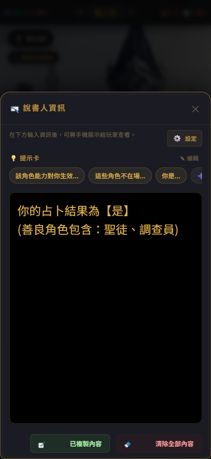
6. **清除全部內容**
   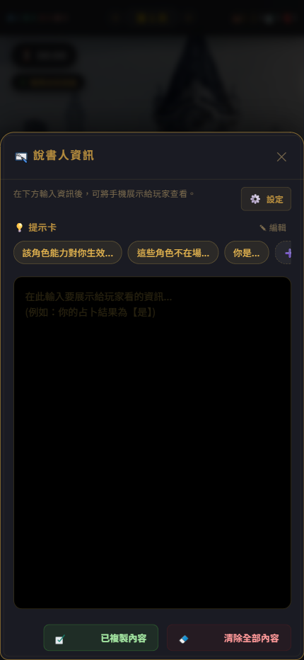
7. **關閉白板面板**
   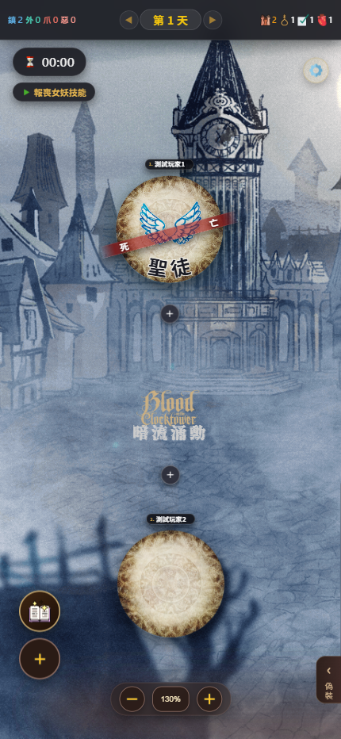

---

祝您遊戲愉快！如有任何疑問，請參閱聯繫開發團隊。
