# 血染鐘樓魔典
## 說書人（Storyteller）使用手冊

---

##  主畫面與全域控制區

### 1. 新增玩家
*   **操作流程**：
    1. 點擊主畫面左下角金色邊框內含黑色「」圖示的按鈕。
    2. 螢幕中央會彈出一個半透明輸入框，在輸入欄中填寫玩家名稱。
    3. 點擊「確認」即可在魔典上新增一個玩家座位。
    
    
    
    ![hover 新增玩家按鈕]
    
    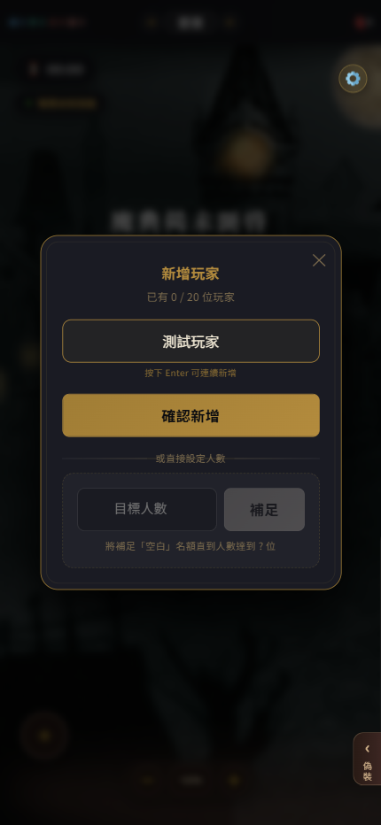
    
    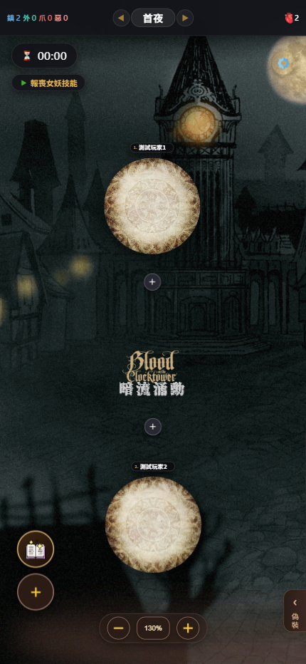

### 2. 檢視實體劇本（實體劇本大圖）
*   **操作流程**：
    1. 點擊「新增玩家」按鈕正上方的實體劇本圖標按鈕。
    2. 螢幕中央將彈出**實體劇本的大圖檢視 Overlay**。
    3. 您可以對大圖進行拖曳、雙指捏合縮放。點擊大圖右上角的「✕」按鈕或點擊大圖外側陰影處，即可關閉大圖。
    
    
    
    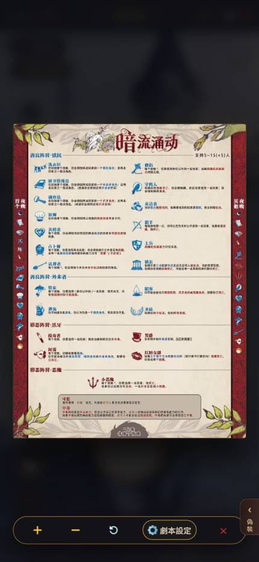
    
    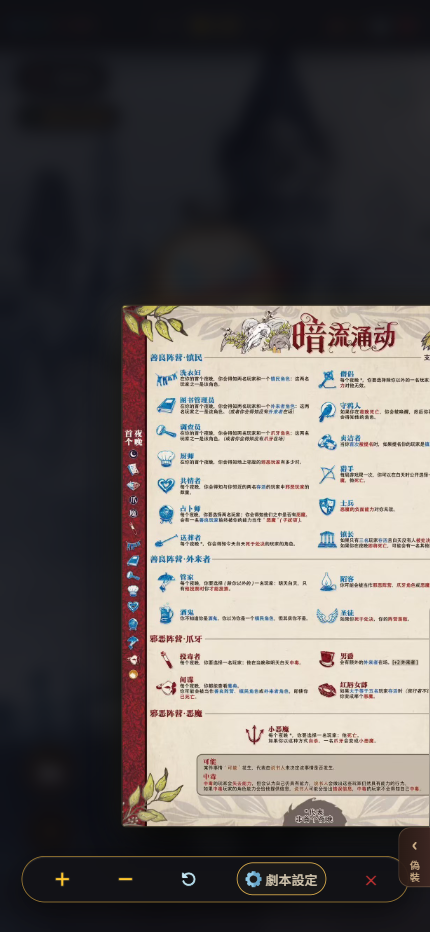
    
    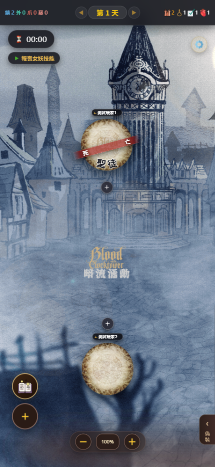

### 3. 功能選單（齒輪選單）
*   **操作流程**：
    1. 點擊主畫面右下角帶有齒輪「」圖示的按鈕，選單會向上滑動展開：
        *   **設置 ()**：開啟系統設置、管理劇本角色。
        *   **夜晚順序 ()**：顯示夜間角色行動次序。
        *   **隱私模式 ()**：一鍵隱藏或顯示所有座位上的角色。
        *   **魔典排列形狀**：點擊可切換座位排列為圓形、矩形或自由排列。
        *   **投票管理 ()**：管理白天的提名與投票計票。
        *   **說書人資訊白板 ()**：點擊會展開說書人白板記錄頁面。
    2. 再次點擊原本的齒輪位置（此時顯示為「」關閉圖示）即可收起選單。
    
    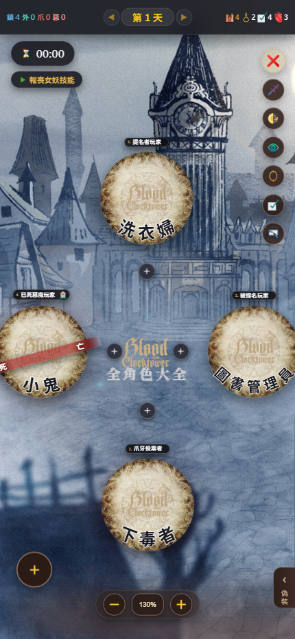
---

##  玩家個人狀態與角色指派

### 1. 開啟玩家控制面板
*   **操作流程**：直接點擊魔典圓環上該玩家的圓形頭像（Token），控制面板將從底部滑入。
    
    
    
### 2. 指派角色
*   **操作流程**：
    1. 點擊面板頂部的「變更角色」按鈕。
    2. 選擇想要指派的角色卡片。玩家頭像將即時更新為該角色的插畫與名稱。
        
    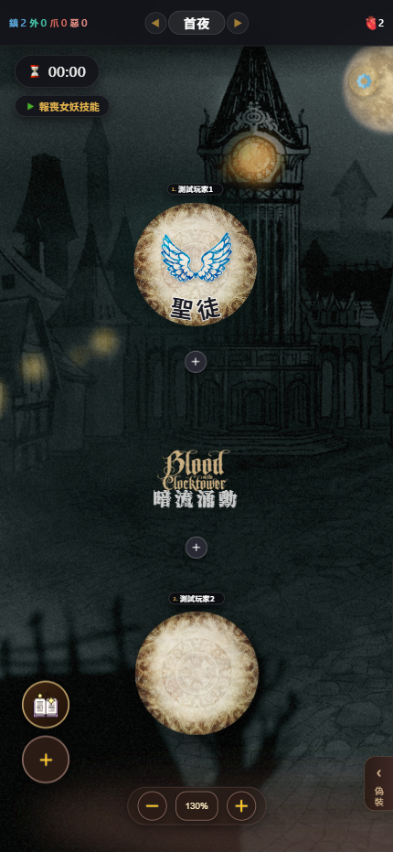

### 3. 標記死亡狀態與幽靈票
*   **操作流程**：
    1. 在控制面板中點擊「死亡狀態」開關，使頭像變為灰色覆蓋骷髏圖案。
    2. 死亡玩家頭像旁會自動出現一張「幽靈投票券」標記，代表其擁有最後一次的死亡投票權（幽靈票）。再次點擊可在計票時消耗該幽靈票。    
    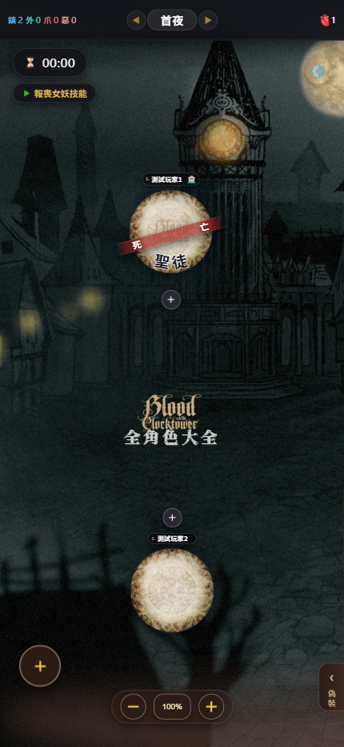

---

##  提示標記管理 (ReminderPicker)

*   **入口位置**：在玩家座位旁或玩家控制面板中，點擊小標籤「」圖示。
*   **操作流程**：
    *   **快速新增**：點擊任意「通用標記」（善良/邪惡）或「專屬標記」圓角按鈕即可貼上。
    *   **自訂新增**：在輸入框輸入內容後點擊右側的新增按鈕。
    *   **刪除或編輯**：點選最上方現有標記，輸入框會進入修改模式，點選右側垃圾桶即可刪除。
    
    
    
    
    
    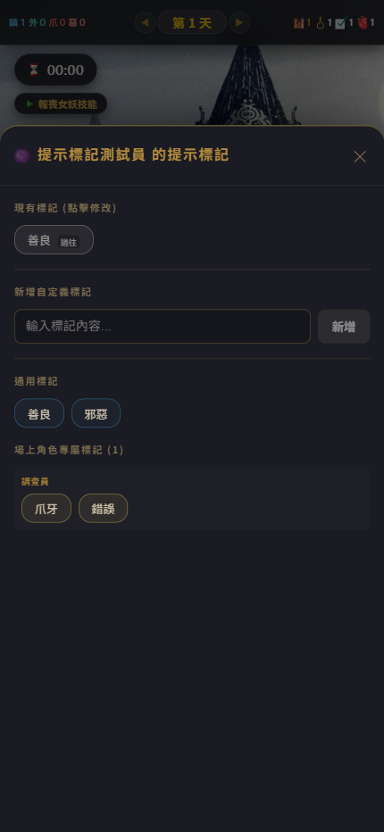
    
    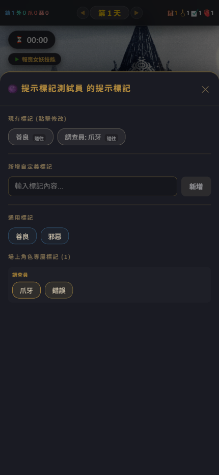
    
    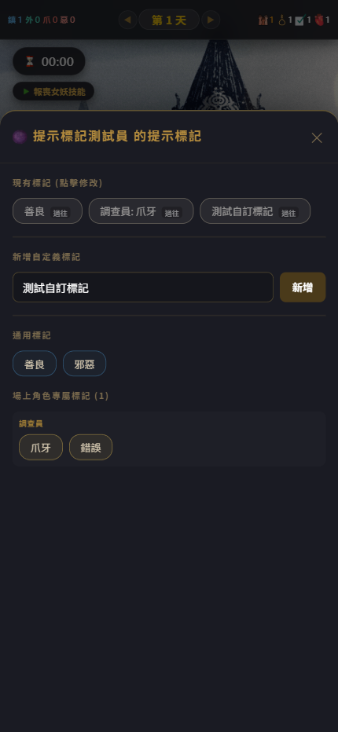
    
    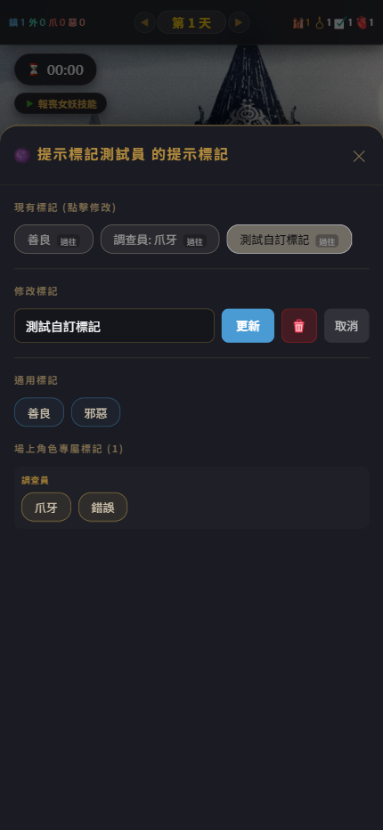
    
    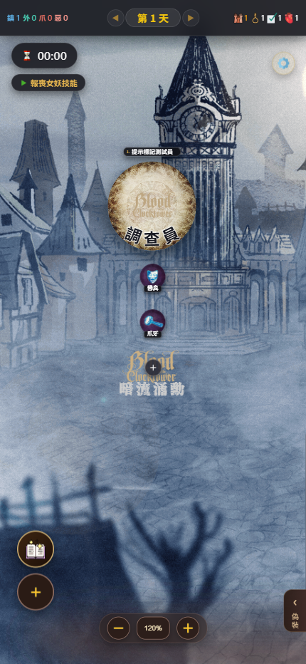

---

##  說書人資訊（白板）記錄

*   **入口位置**：右下角「齒輪」展開選單後，點擊「記事本 ()」圖示。
*   **操作流程**：
    *   **記錄資訊**：在文字框內鍵入資訊（例如：「你的占卜結果為【是】」）。
    *   **一鍵複製**：點擊底部左側「複製全部文字」按鈕，成功後會顯示已複製內容的提示。
    *   **一鍵清空**：點擊底部右側「清除全部內容」按鈕即可重置白板。
    
    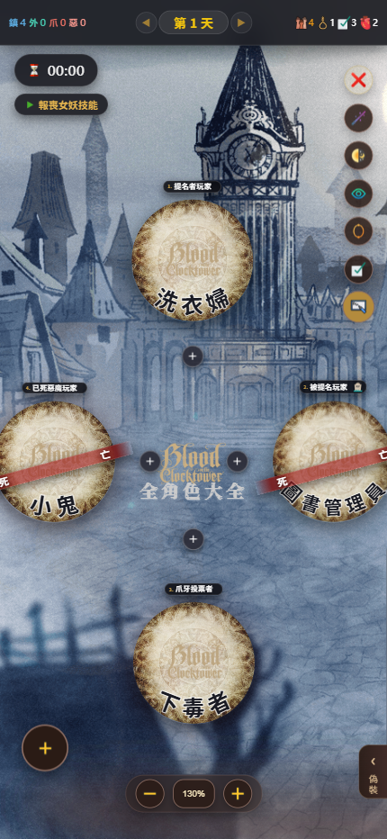
    
    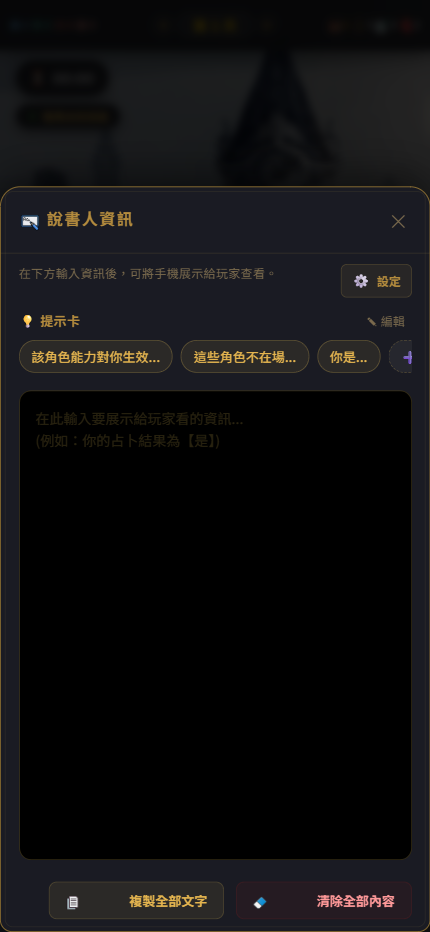
    
    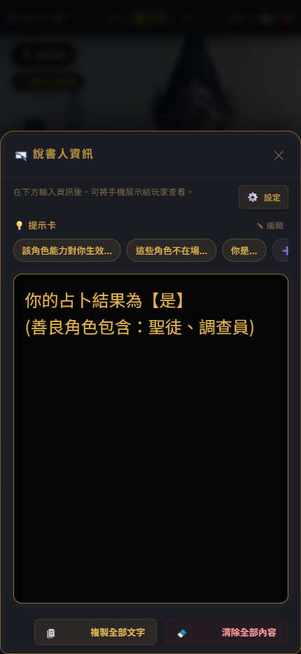
    
    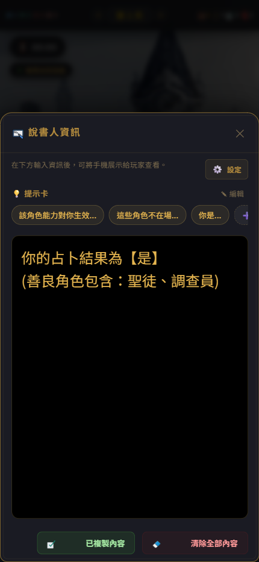
    
    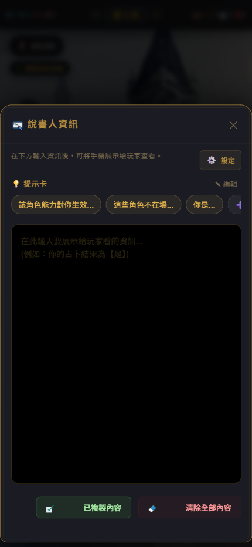
    
    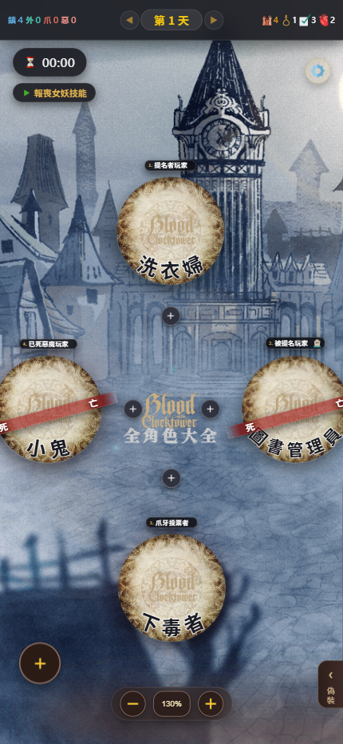

##  進入投票面板

*   **開啟功能選單**
    *   **按鈕位置**：主畫面右下角。
    *   **操作**：點擊帶有齒輪「」圖示的圓形按鈕展開功能選單。
    
    
    
*   **開啟投票管理**
    *   **按鈕位置**：齒輪選單展開後的按鈕之一（「」圖示）。
    *   **操作**：點擊名稱為 **投票管理** 的按鈕，投票管理面板將從畫面下方滑入。
    
    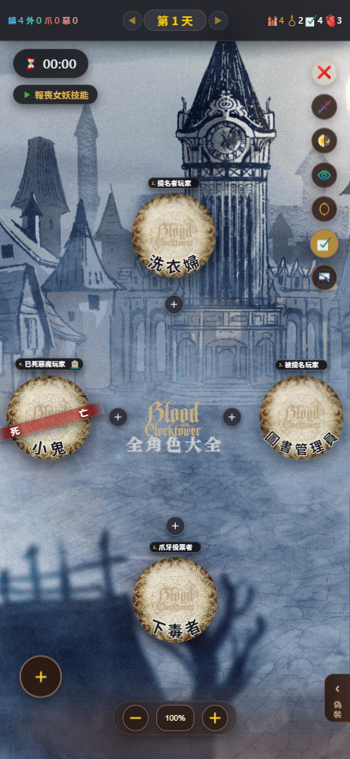
    
    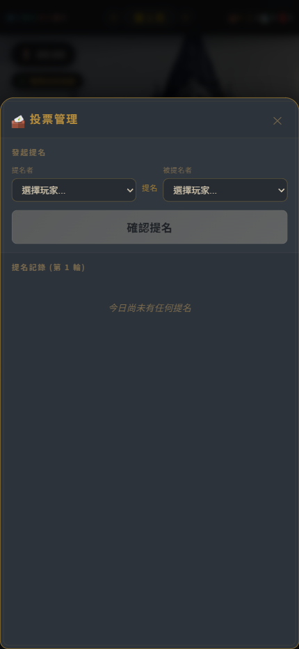

---

##  發起提名

本區塊僅在白天階段顯示，用於為玩家建立新提名：

*   **選擇提名者與被提名者**：
    *   **提名者**：左側下拉選單，僅列出目前存活且今天還能提名的玩家。
    *   **被提名者**：右側下拉選單，僅列出今天尚未被提名的玩家。
*   **確認發起提名**：
    *   點選下拉選單下方的 **確認提名** 按鈕即可完成發起。
    
    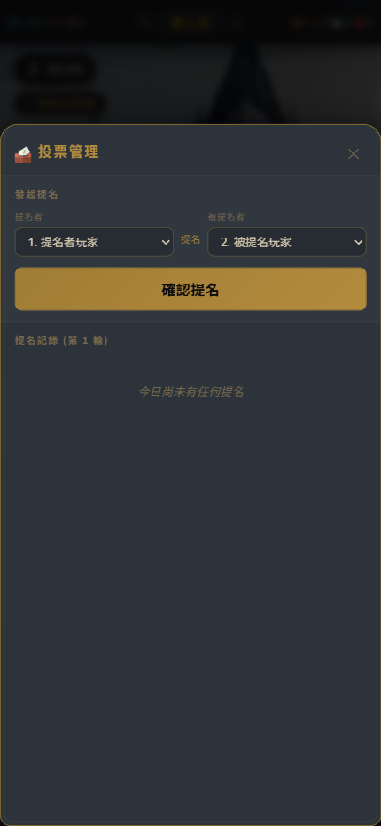

---

##  邪惡勢力統計

當場上存在提名時，面板最上方會自動顯示一個紅色的邪惡勢力統計欄，僅限主持說書人可見：

*   ** 爪牙提名**：統計今日爪牙發起提名的總次數。
*   ** 惡魔投票**：統計今日投票中，惡魔投出贊成票的累計總次數。
*   *註：若在設定中開啟隱私模式（隱藏角色），此紅色統計欄將會自動隱藏。*

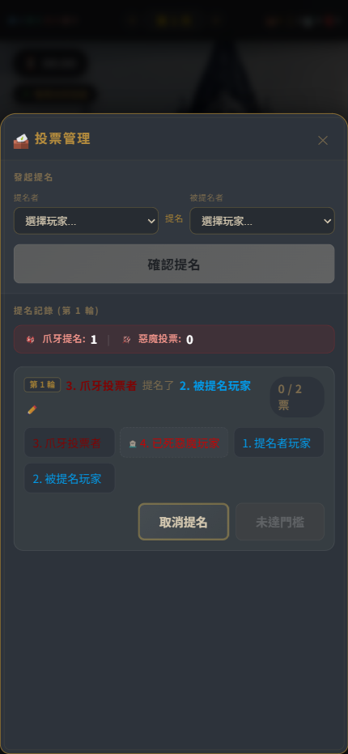

---

##  提名記錄與編輯

每一次發起的提名都會在下方產生一張獨立的提名卡片：

*   **檢視提名資訊**：卡片頂部顯示「第 X 輪」標籤與提名人和被提名人姓名。右上角顯示獲得票數與處決門檻（若達門檻會呈現金色高亮）。
*   **修改提名**：點選名字旁的編輯按鈕 **** 可展開編輯選單重新指派玩家。
    
    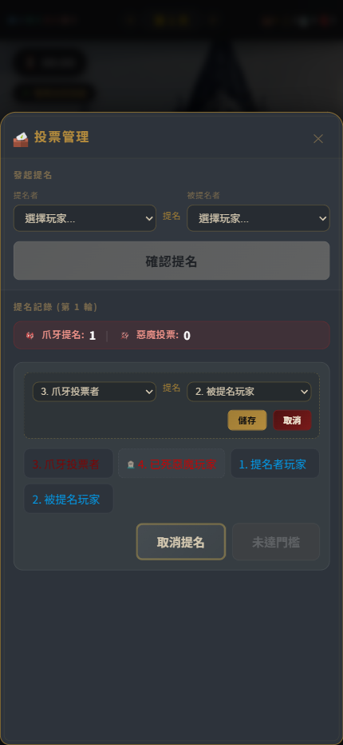
    
*   **取消提名記錄**：點選卡片底部的 **取消提名** 按鈕，確認後會移除該提名並退還可能已消耗的幽靈票。

---

##  投票計票與處決

*   **投票計票網格**：
    *   卡片中間顯示所有存活及已死亡的玩家座位按鈕。
    *   **投贊成票**：點擊玩家按鈕使其亮起並顯示勾號 **** ，票數即時累加。
    *   **死亡玩家（靈魂投票）**：死亡玩家按鈕會帶有 **** 圖示。投贊成票後，其幽靈票會被自動扣除；已無幽靈票的死亡玩家按鈕會呈現半透明灰化且無法點擊。
    
    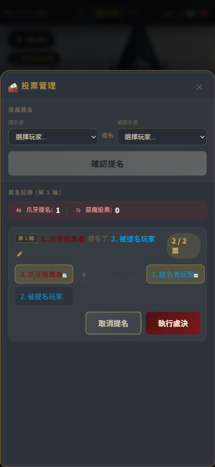
    
*   **執行處決**：
    *   當某個提名的贊成票數已達門檻，且為今日唯一最高票時，右下角的 **執行處決** 按鈕會被啟用。點擊確認後即可處決該被提名玩家。
        
    
    
*   **已處決徽章與撤銷**：
    *   處決執行後，卡片會變為半透明並顯示 ` 已處決`。您可以點擊 **撤銷** 按鈕來恢復被處決玩家的存活狀態。
    
    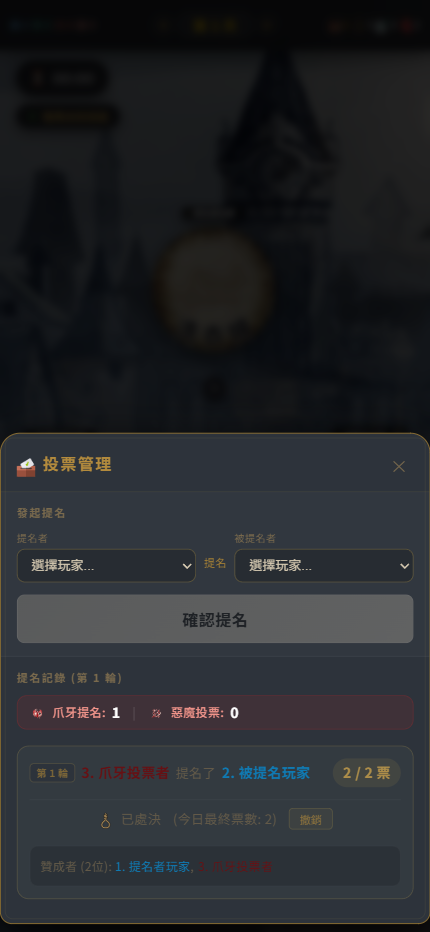
